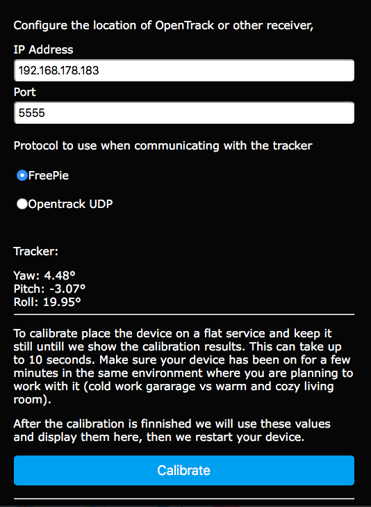
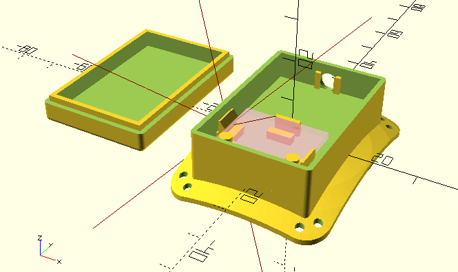

# Head tracking with esp8266/esp8265 and MPU6050

# Installation

Install platform IO

```bash
# Build char* array for web
./javascriptToHeader.sh
platformio run --target upload -e wemos
platformio device monitor --baud 115200
```

# How to use

The device will create a new network so for a once time setup you need to have your computer or mobile phone connect to this network and congirue the wifi.


If you did monitor your device it will show you the IP address of the access point.

While you are at it go to the setup page to tell setup the location and protocol to send data to. You can also calibrate the MPU (Motion Processing Unit). Read the instructions carefully!



* FreePie protocol sends Yaw Pitch and Roll using the FreePie format. This has been tested with OpenTrack
* OpenTrackUDP sends Yaw Pitch and Roll using a simple floar array. This has been tested with OpenTrack.

# Where to put the MPU

I have designed a little box that can be printed using a 3D printer.
It´s a bit tricky to print but it will work out if you put up some support material. The STL file (mpu6050_holder.stl) is included. Then I have sewed it on a baseball cap. I´s very light and you will hardly fill it.



The ESP8266 can be put in a other box and you can connect the MPU6050 and ESP8266 using a 5 wire shielded cable. Make sure it´s not longer than 1.5 to 2 meter (I have tested 1.5m) otherwhise I2C communication mght fail.

